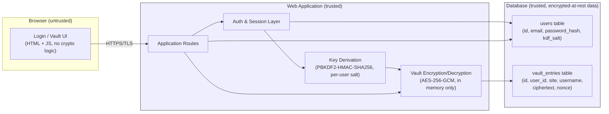

# Design Document — Web-Based Secure Password Manager

Checkpoint 1: threat model and architecture (Week 4)

## 1. System Architecture

**Trust boundaries** (marked by the `Client` box above vs. everything else):
1. **Browser ↔ Server** — the browser is fully untrusted. Nothing sent from it (form fields, cookies, hidden inputs) is trusted without server-side re-validation. All traffic crosses this boundary over TLS.
2. **Server ↔ Database** — the app server is trusted to talk to the DB, but the DB itself is treated as an untrusted disk: it never stores plaintext passwords, master passwords, or derived keys — only password *hashes* (for login) and AES-GCM *ciphertext* (for vault entries).

**Where encryption happens:** the master password is submitted once at login over TLS, the server derives a symmetric key from it with PBKDF2-HMAC-SHA256 (never stored), and that key exists only in server memory for the duration of the request/session — it is used to encrypt new vault entries and decrypt existing ones on the fly. The browser only ever receives decrypted entries over the already-encrypted TLS channel; it does no crypto itself in this design.

## 2. Threat Model (mapped to OWASP Top 10 and Weeks 1–4 attack classes)

| # | Threat | OWASP / Class | Intended mitigation |
|---|--------|----------------|----------------------|
| 1 | Stolen DB dump reveals vault contents | A02: Cryptographic Failures | Vault entries stored only as AES-256-GCM ciphertext; master password/key never persisted; DB alone is useless without the key |
| 2 | Weak/guessable master password lets attacker brute-force the key | A02: Cryptographic Failures | PBKDF2-HMAC-SHA256 KDF (600,000 iterations, per OWASP) with unique per-user salt; minimum password-strength rule at signup |
| 3 | SQL injection via login or vault-entry forms | A03: Injection | All queries via parameterized statements / SQLAlchemy ORM, never string-built SQL |
| 4 | Stored/reflected XSS (malicious JS in a saved site name or note) | A03: Injection (HTML/JS injection) | Jinja2 auto-escaping on all templates; Content-Security-Policy header; input length/charset validation |
| 5 | Attacker tampers with hidden form fields or JSON body (e.g. changes `user_id` to view another user's entries) | A01: Broken Access Control / Input tampering | Every query scoped server-side to `session.user_id`, never to a client-supplied ID; ownership re-checked on every read/write |
| 6 | Client disables JS-based validation to submit malformed/oversized data | Client-side control bypass | All validation re-run server-side; client-side checks treated as UX only, never as security control |
| 7 | Session fixation — attacker pre-sets a victim's session cookie | A07: Identification & Authentication Failures | Session ID regenerated on every successful login; old session invalidated |
| 8 | Stolen session cookie used to hijack an active session | A07: Identification & Authentication Failures | Cookies flagged `HttpOnly`, `Secure`, `SameSite=Strict`; short idle timeout; TLS-only transport |
| 9 | Brute-force / credential-stuffing against login | A07: Identification & Authentication Failures | Rate limiting + account lockout/backoff on repeated failed logins; password hashed with bcrypt |
| 10 | CSRF — a malicious page submits a form to add/delete a vault entry on the victim's behalf | A01: Broken Access Control | CSRF token on every state-changing form, validated server-side |
| 11 | Verbose error pages/stack traces leak internals | A05: Security Misconfiguration | Debug mode off in production; generic error pages; secrets loaded from environment, not source |
| 12 | Man-in-the-middle on plain HTTP | A02: Cryptographic Failures | App served over TLS only; HTTP requests redirected to HTTPS; HSTS header |

## 3. Technology Stack

| Layer | Choice | Why |
|-------|--------|-----|
| Framework | Python + Flask | Small, explicit surface area — good for a first security project because nothing "magic" hides where validation/escaping happens; large ecosystem of well-documented security extensions |
| Database | SQLite (via SQLAlchemy ORM) | Zero setup, file-based, fine for a course project; SQLAlchemy gives parameterized queries by default, which closes off SQL injection without hand-written escaping |
| Crypto library | `cryptography` (AES-256-GCM) + stdlib `hashlib.pbkdf2_hmac` (PBKDF2-SHA256 KDF) | `cryptography` is an audited, actively maintained library recommended over hand-rolled crypto; GCM gives confidentiality **and** integrity (tamper-evident ciphertext) in one primitive. PBKDF2 needs no extra native dependency (it's in Python's standard library), which keeps setup simple; `argon2-cffi` is a stronger, memory-hard alternative worth adopting later if the environment supports it |
| Password hashing (login) | `bcrypt` | Separate from the vault-encryption key derivation — login auth and vault decryption are deliberately different secrets/mechanisms |
| Session/auth | Flask-Login + Flask's signed session cookies | Well-tested, avoids reinventing session handling |
| Transport | TLS via a reverse proxy (e.g. Caddy/Nginx in front of Flask) in production; `flask run --cert=adhoc` for local HTTPS testing | Keeps TLS termination out of application code; Caddy auto-provisions certs, simplest path for a student deployment |

## 4. Cryptographic Design

- **Login secret vs. vault key are different values.** At signup, the master password is (a) hashed with bcrypt and stored as `password_hash` for authentication, and (b) run through PBKDF2-HMAC-SHA256 (600,000 iterations) with a random per-user `kdf_salt` to derive a 256-bit vault key — the salt is stored, the derived key is not.
- **What the server does:** on each authenticated request that touches the vault, the server re-derives the key from the master password held only in the current session's memory (never written to disk or logs), and uses it to AES-GCM-encrypt/decrypt individual vault entries.
- **What the database stores:** `email`, `password_hash`, `kdf_salt` for the user; and per entry, `site`, `username` (plaintext, needed for search/display), plus `ciphertext` and `nonce` for the secret (the actual saved password). The encrypted value's GCM authentication tag also means a tampered ciphertext fails to decrypt rather than silently returning garbage.

## 5. Authentication & Session Model

- **Login:** email + master password → bcrypt-verified → on success, session ID is regenerated (fixation prevention) and a new session cookie issued.
- **Cookie flags:** `HttpOnly` (not readable by JS, blocks XSS-based theft), `Secure` (TLS-only), `SameSite=Strict` (blocks CSRF via cross-site requests).
- **Session lifetime:** 20-minute idle timeout, 8-hour absolute maximum; expired sessions force re-login (and re-entry of the master password, since the vault key isn't persisted).
- **Fixation prevention:** session identifier is rotated on every privilege change (login, logout).
- **Optional MFA (stretch goal, not required for Checkpoint 1):** TOTP-based second factor via `pyotp`, enrolled after first login, required on subsequent logins if enabled.
